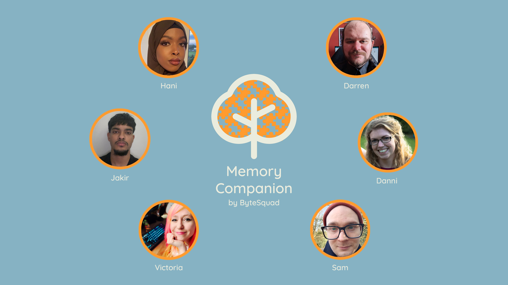
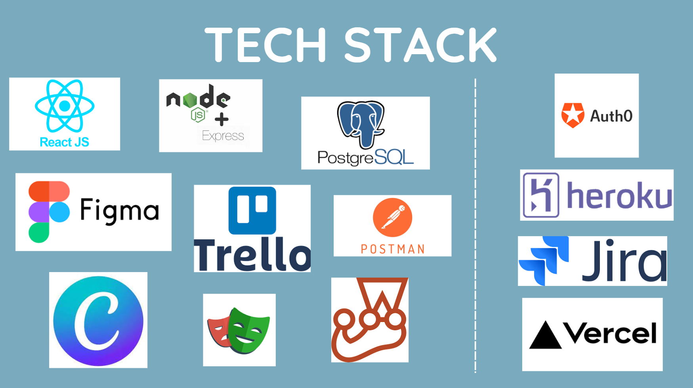

# Memory Companion App

## Table of Contents

- [About](#about)
- [How to use](#how-to-use)
- [Problem Statement](#problem-statement)
- [Team Manifesto](#team-manifesto)
- [Process](#process)
- [Tech Stack](#tech-stack)
- [Team Members](#team-members)

## About

Memory Companion is a user-friendly application designed to support individuals suffering from dementia and other memory-related conditions. Our app aims to provide a centralized platform for storing memories, visual and audio prompts, and daily activity reminders, tailored to each individual's objectives. By facilitating social care and improving the overall quality of life for those affected by memory loss, our goal is to empower users and enhance their independence.

## How to use
To browse our application we'd like you to use the following Username and Password upon logging in to access established dummy data for our demo: 

Username: bytesquaduser1@outlook.com
Password: ByteSquad1!

The app has delete functionality - for the purpose of the dummy data we kindly ask that you don't delete any data :) 

Deployment link: Incoming after important Demo Day on 05/07/23 - We'll deliver soon!

<!-- DO NOT UNCOMMENT UNTIL 06/07/2023 ONCE THE DEMO IS DONE :) -->
<!-- You can view our live application [here](https://byte-squad-frontend-memory-companion.vercel.app/) -->

## Problem Statement

Many individuals suffering from dementia and other conditions struggle to retain memories, follow daily activities, and maintain independence due to memory loss. There is a need for a user-friendly application that provides a centralized platform for storing memories, visual and audio prompts, and daily activity reminders, tailored to the individual's objectives. This application should support multiple users, facilitating social care and improving the overall quality of life for those affected by dementia and other conditions.

## Team Manifesto

As a team, we have established core values and working principles that guide our collaboration and decision-making process. These principles are essential to ensure a positive and effective working environment:

### Core Values

- Trust
- Respect
- Honesty
- Open communication
- Equal opportunity
- Safety
- Learning

### Working Principles

- Psychological safety is key. No question is stupid!
- Everyone's voice is heard and valued.
- Committed to continuous improvement.
- Blameless culture. Mistakes are welcome and seen as opportunities to learn.
- Recovery Process: 10/10/10 - 10 minutes discussion, 10-minute break, 10 minutes with the group.
- Disagree and commit.

### Conflict Resolution

- Don't take anything to heart.
- Treat people as you would like to be treated.
- Have fun!
- Disagree and commit.
- Bring disagreement to the team if a resolution can't be met.
- Use the 10/10/10 method (10-minute discussion, 10-minute break, 10 minutes with the rest of the team).

## Process

Throughout the development of the Memory Companion app, we followed a collaborative and iterative process to ensure the best possible outcome. Our process included the following:

- Utilising Trello for project management and tracking our progress and successes.
- Using Jira for creating and tracking user stories, flow, and creating tickets.
- Conducting thorough user research to understand the needs and preferences of our target users.
- Mapping out user journeys to ensure a seamless and intuitive user experience.
- Incorporating feedback and lessons learned in daily stand-ups and retrospectives.
- Embracing a blameless culture where mistakes are seen as learning opportunities.

## Tech Stack

## Team Members

Meet our talented and diverse team members who worked hard to bring the Memory Companion app to life:

- Hani: Former science teacher. [Linked In](https://www.linkedin.com/in/hani-abdi-hassan-84762a271/). [GitHub Profile](https://github.com/RHani24). [CV](https://flowcv.com/resume/rbgq0cairo)
- Jakir: Computer science graduate and former E-commerce business owner. [GitHub Profile](https://github.com/jakir-github). [CV](jakir_cv.pdf)
- Victoria: Wine business entrepreneur. [Linked In](https://www.linkedin.com/in/vplatt/)[GitHub Profile](https://github.com/veepgoose). [CV](https://flowcv.com/resume/tidrmg7102))
- Sam: Computer science graduate. [Linked In](https://www.linkedin.com/in/sambaldwin1/) [GitHub Profile](https://github.com/SBaldwin-Git). [CV](https://flowcv.com/resume/iflo58kcar)
- Danni: Former project manager in the bus industry. [Linked In](https://www.linkedin.com/in/danielle-shuttleworth/). [GitHub Profile](https://github.com/dannishuttleworth). [CV](danni_cv.pdf)
- Darren: Former Guest Service operator. [Linked In](https://www.linkedin.com/in/d-p-broomhall-ffx4shb19/) [GitHub Profile](https://github.com/Darren-p-b). [CV](https://flowcv.com/resume/m8oodqobun)

Feel free to explore their profiles and CVs to learn more about their skills and contributions to the Memory Companion app.

